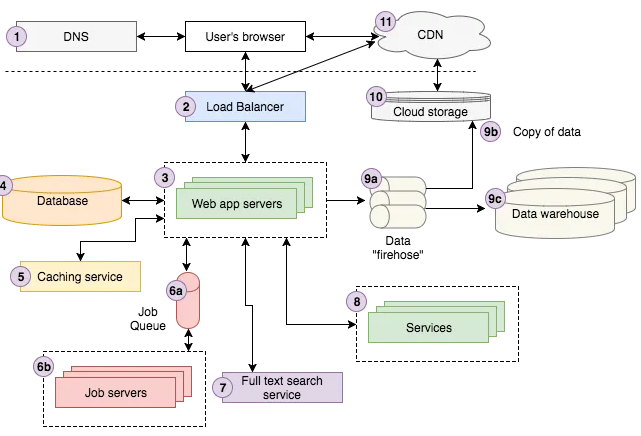

# Silkgo

This is a complete full-stack web application, integrating a SQLite database and RESTful API with a dynamic frontend.

It was based off the basic characteristics of channels in Discord platform.

## Architecture



### Cloning the repository

--> Clone the repository using the command below :

```bash
git clone https://github.com/swoji/Portfolio-stack.git

```

--> Move into the directory where we have the project files :

```bash
cd silkgo

```

--> Create a virtual environment :

```bash
# Let's install virtualenv first
pip install virtualenv

# Then we create our virtual environment
virtualenv envname

```

--> Activate the virtual environment :

```bash
envname\scripts\activate

```

--> Install the requirements :

```bash
pip install -r requirements.txt

```

#

### Running the App

--> To run the App, we use :

```bash
python manage.py runserver

```

> ⚠ Then, the development server will be started at http://127.0.0.1:8000/

